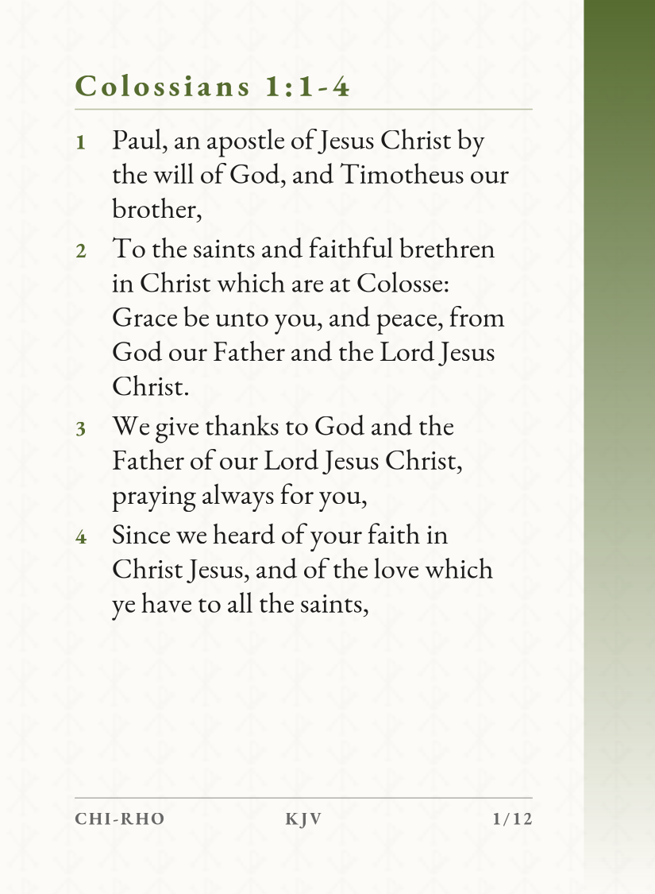
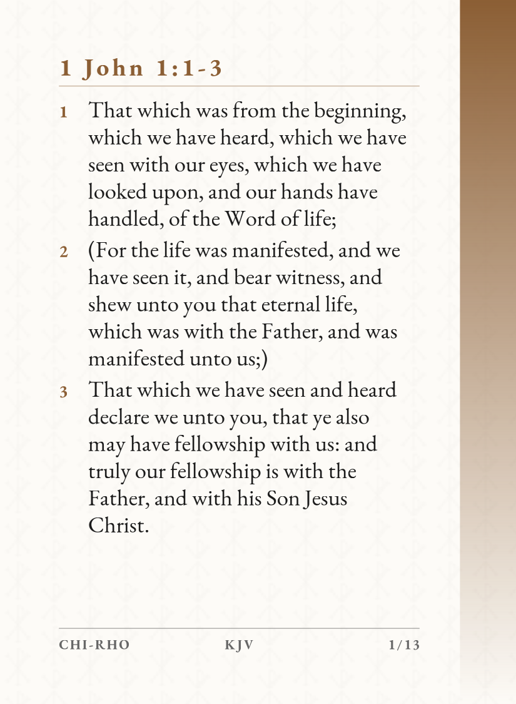
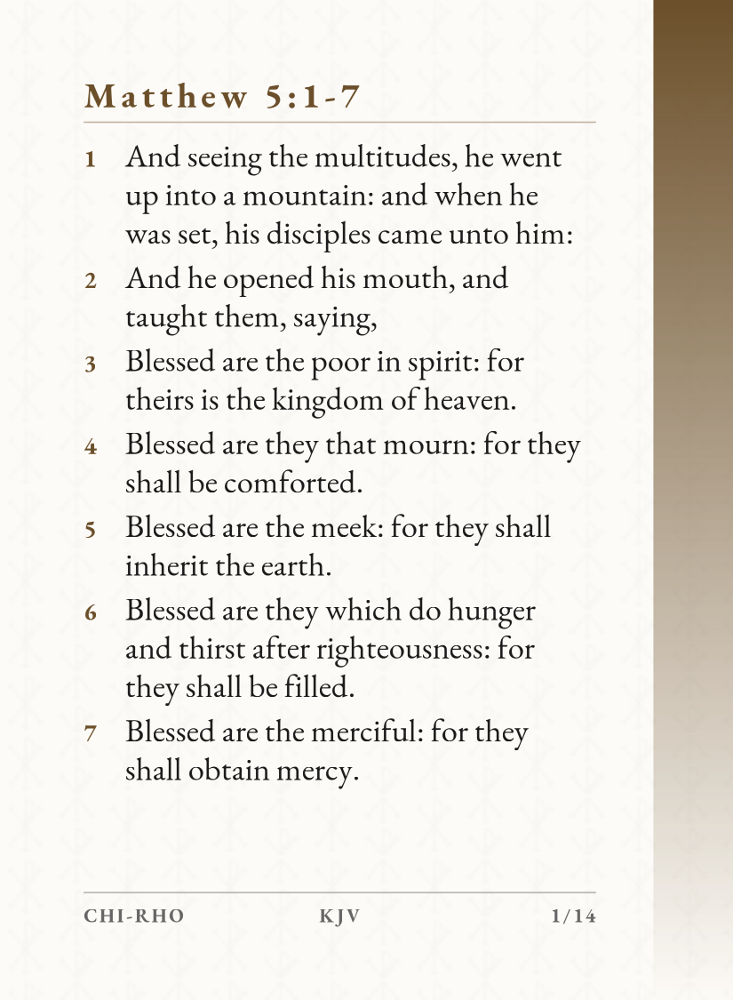
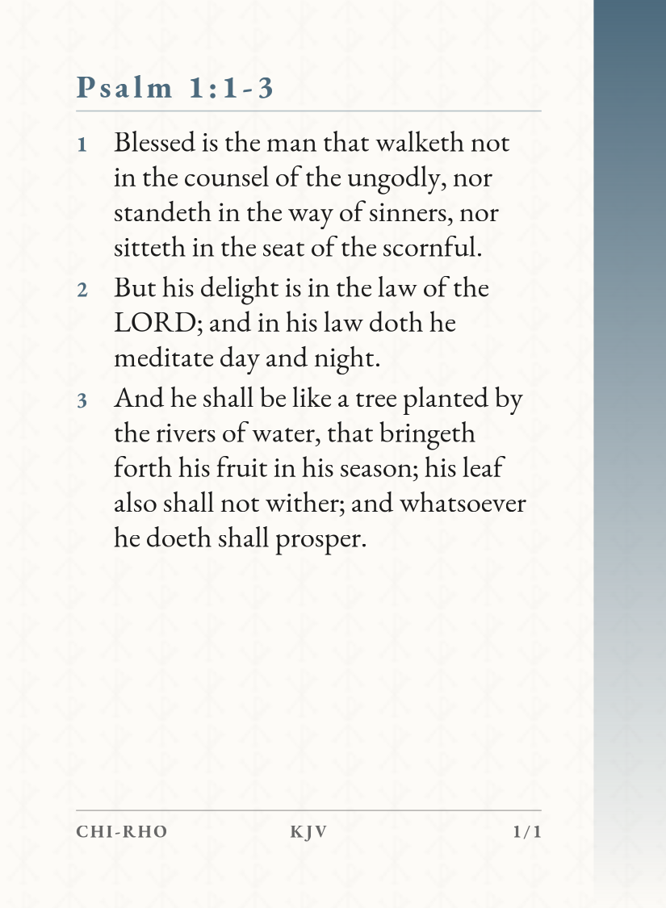
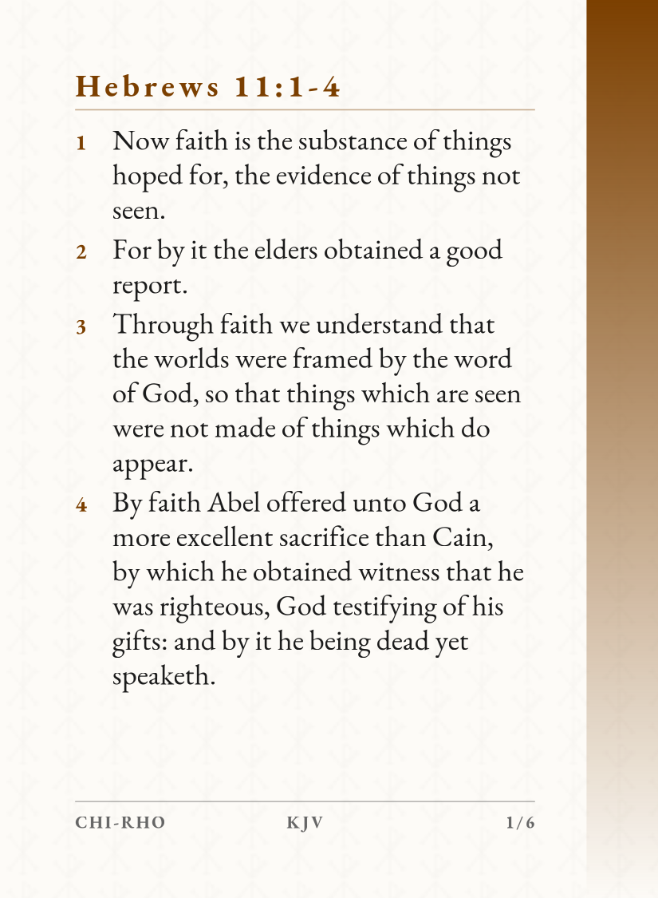
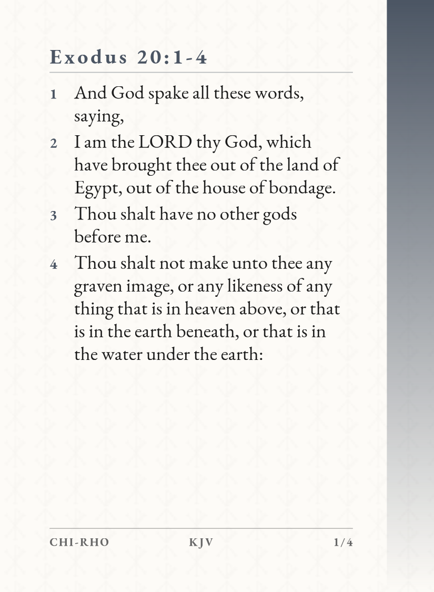

# Chi-Rho Cards

SVG-first KJV scripture card generation with measured EB Garamond pagination, trim/bleed exports, alternating gradient sides, and per-book themes.

The result is a print-ready card system: vector source files, 300 DPI bleed PNGs, derived trim previews, and responsive galleries for reviewing an entire passage at a glance.

The gallery links use GitHub Pages so they open as rendered visual galleries instead of repository source files. Enable **Settings → Pages → GitHub Actions** once in the repository; the workflow in `.github/workflows/deploy-pages.yml` then republishes the current `output/` catalogs on every push to `main`.

## Card Showcase

<table>
<tr>
<td align="center"><strong>1 Peter</strong><br><a href="https://deangadberry.github.io/Chi-Rho_Cards/1_peter/gallery.html" target="_blank" rel="noopener noreferrer"></a></td>
<td align="center"><strong>James</strong><br><a href="https://deangadberry.github.io/Chi-Rho_Cards/james/gallery.html" target="_blank" rel="noopener noreferrer"></a></td>
<td align="center"><strong>Colossians</strong><br><a href="https://deangadberry.github.io/Chi-Rho_Cards/colossians/gallery.html" target="_blank" rel="noopener noreferrer"></a></td>
<td align="center"><strong>1 John</strong><br><a href="https://deangadberry.github.io/Chi-Rho_Cards/1_john/gallery.html" target="_blank" rel="noopener noreferrer"></a></td>
</tr>
<tr>
<td align="center"><strong>Sermon on the Mount</strong><br><a href="https://deangadberry.github.io/Chi-Rho_Cards/sermon_on_the_mount/gallery.html" target="_blank" rel="noopener noreferrer"></a></td>
<td align="center"><strong>Psalm 1</strong><br><a href="https://deangadberry.github.io/Chi-Rho_Cards/psalm_1/gallery.html" target="_blank" rel="noopener noreferrer"></a></td>
<td align="center"><strong>Hebrews 11</strong><br><a href="https://deangadberry.github.io/Chi-Rho_Cards/hebrews_11/gallery.html" target="_blank" rel="noopener noreferrer"></a></td>
<td align="center"><strong>Exodus 20</strong><br><a href="https://deangadberry.github.io/Chi-Rho_Cards/exodus_20/gallery.html" target="_blank" rel="noopener noreferrer"></a></td>
</tr>
</table>

| Book or Passage | Cards | Accent | Gallery | Upload PNGs |
|---|---:|---|---|---|
| 1 Peter | 28 | Royal blue `#003399` | <a href="https://deangadberry.github.io/Chi-Rho_Cards/1_peter/gallery.html" target="_blank" rel="noopener noreferrer">View gallery</a> | [Open PNG folder](output/1_peter/full_bleed_png/) |
| James | 25 | Oxblood `#7A2E2E` | <a href="https://deangadberry.github.io/Chi-Rho_Cards/james/gallery.html" target="_blank" rel="noopener noreferrer">View gallery</a> | [Open PNG folder](output/james/full_bleed_png/) |
| Colossians | 23 | Olive `#556B2F` | <a href="https://deangadberry.github.io/Chi-Rho_Cards/colossians/gallery.html" target="_blank" rel="noopener noreferrer">View gallery</a> | [Open PNG folder](output/colossians/full_bleed_png/) |
| 1 John | 26 | Brown `#8B5E34` | <a href="https://deangadberry.github.io/Chi-Rho_Cards/1_john/gallery.html" target="_blank" rel="noopener noreferrer">View gallery</a> | [Open PNG folder](output/1_john/full_bleed_png/) |
| Sermon on the Mount | 27 | Warm umber `#6B4F2A` | <a href="https://deangadberry.github.io/Chi-Rho_Cards/sermon_on_the_mount/gallery.html" target="_blank" rel="noopener noreferrer">View gallery</a> | [Open PNG folder](output/sermon_on_the_mount/full_bleed_png/) |
| Psalm 1 | 2 | Blue gray `#4C6A7D` | <a href="https://deangadberry.github.io/Chi-Rho_Cards/psalm_1/gallery.html" target="_blank" rel="noopener noreferrer">View gallery</a> | [Open PNG folder](output/psalm_1/full_bleed_png/) |
| Hebrews 11 | 11 | Brown gold `#7B3F00` | <a href="https://deangadberry.github.io/Chi-Rho_Cards/hebrews_11/gallery.html" target="_blank" rel="noopener noreferrer">View gallery</a> | [Open PNG folder](output/hebrews_11/full_bleed_png/) |
| Exodus 20 | 7 | Slate `#4B5563` | <a href="https://deangadberry.github.io/Chi-Rho_Cards/exodus_20/gallery.html" target="_blank" rel="noopener noreferrer">View gallery</a> | [Open PNG folder](output/exodus_20/full_bleed_png/) |

## Generate A Book

```text
python generate_csv.py --book 1peter
python svg_draft.py --book 1peter

python generate_csv.py --book james
python svg_draft.py --book james

python generate_csv.py --book sermon_on_the_mount
python svg_draft.py --book sermon_on_the_mount

python generate_csv.py --book colossians
python svg_draft.py --book colossians

python generate_csv.py --book 1john
python svg_draft.py --book 1john

python generate_csv.py --book psalm_1
python svg_draft.py --book psalm_1

python generate_csv.py --book hebrews_11
python svg_draft.py --book hebrews_11

python generate_csv.py --book exodus_20
python svg_draft.py --book exodus_20
```

Outputs are written to the book-named folder under `output/`. Each book includes:

- `full_bleed_png/`: upload-ready PNGs named `{book}_card_{number}.png`
- `gallery.html`: responsive cut-card gallery
- `vector_card_sources/`: canonical `{book}_card_{number}` SVGs, previews, and derived cut PNGs

Configured titles currently include:

- `1peter`
- `james`
- `colossians`
- `1john`
- `sermon_on_the_mount`
- `psalm_1`
- `hebrews_11`
- `exodus_20`

Add future books or passages in `src/book_config.py` with their API ID, chapter span, reference name, accent color, data path, and output path.

## Validate

```text
python -m py_compile src/*.py generate_csv.py svg_draft.py
```

The old browser renderer is preserved under `legacy/` for comparison only.